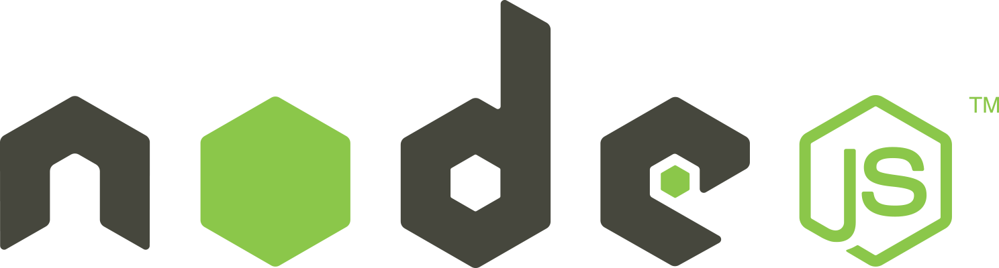
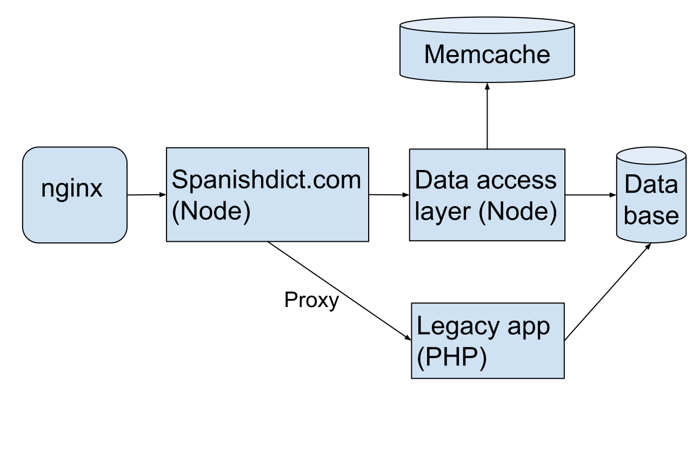

# Leveraging Node.js
at Fluencia

Note:
- My name is William, and I'm going to talk about how we leverage Node.js at my
  company, Fluencia.
- Aprovechando Node.js

### 2011: the situation.

* Have a fast-growing website that cannot go down or slow down, ever.
* Want to build a brand new SPA that people will pay you money to use.
* Do it with two or three engineers. ASAP.

Note:
- I want to start by briefly turning back the clock to late 2011.
- Put yourself in the shoes of the CEO of a small (like 3 employees) but growing
  company.
- (slides)

## What are you going to
## build the future on?

Note:
- This is the question the company was asking itself.
- The existing PHP codebase was showing its age.
- Engineering team at the time (such as it was, really the CEO and a new
  director of engineering) was very aware of PHP's limitations as a language,
  community, etc..
- Where to go in the future?

Note:
- Big surprise.
- So this company, Fluencia, went with Node, for reasons that I will talk about.
- But first, a little background.

Note:
- I'm William Bert. Senior Software Engineer at Fluencia. I've been here for
  about two years.
- What is Fluencia? Best way to learn Spanish online. Subscription. Over 150K
  users.

Note:
- We also run a reference site called SpanishDict. That's the high-traffic site.
  It used to be the company of the company, but we like Fluencia better.
- SpanishDict gets around 10 million unique visitors a month.
- Top result if you google "Spanish".
- Both of these applications are backed by Node.
- Why? How did it come to be? Some of this was before my time, but I have it on
  good authority from some of the people who were there...

### Wanted:

## Speed / scalability
## Community
## Productivity

Note:
- Speed/scalability:
- Google has made huge investment in making V8 fast.
- No threads. Instead, an event loop. Very lightweight, very scalable.
- Community:
- Big community and growing.
- Lots of libraries already, more being released all the time.
- Productivity:
- I think in 2011, choosing Node when thinking about productivity was a bold
  choice.
- Node does async throughout, unlike other languages where it is bolted on, and
  not all libs support it. Builtin async support throughout was attractive.
- It was changing quickly, but it was stable enough.
- The core is small. The philosophy is for small modules that can be pieced
  together. Simplicity.

## Always bet on Javascript.

Note:
- Common code between front-end and back-end is a nice win.
- Lessons learned in one can often be applied to other. Reduced cost of context
  switching. Actual shared code can make life easier.
- The future (for us) included an SPA. Would need to do heavy lifting in
  Javascript. Full JS stack benefits.
- So this stack just makes sense.

## How we use Node.

Note:
- That's enough about the past and how we made the choice.
- So how do we use Node today?
- Node backs our two main products and their supporting services:

* Fluencia: single page app with API.
* Cicero: text to speech service.
* Aurora: media transformation.

Note:
- Fluencia is an SPA for teaching Spanish to English speakers.
- It was a brand new project in the summer of 2012 when I started with the
  company.
- Now it has more than 150K users.
- It has some supporting services also built with Node.

* AWS
* MongoDB / Mongoose
* Node.js
* Express

* Require
* Backbone
* Jade + LESS
* Travis

Note:
- Fluencia's stack.

### About 8K LOC shared
### between client and server.

- a/b experiments
- access control
- constants
- native language support (nls)
- validation

Note:
- A noteable thing about Fluencia is the shared code.
- Fluencia has about 8K LOC shared between client and server:
- Literally common code between front-end and back-end.
- Shared code makes life easier.
- Lessons learned in one place can often be applied to other.
- Reduced cost of context switching.
- Certain things can be done exactly the same between client and server.

* SpanishDict.com: website.
* Atalanta: data access layer.
* Spotcheck: lightweight S3 log querying.

Note:
- Our other main product is SpanishDict. 10M unique visitors/month.
- Traditional website.
- Also have several supporting services for it written in Node.

* AWS
* MySQL
* Node.js
* Express

* Browserify
* Travis

Note:
- SpanishDict's stack.

## Productivity

- 700+ unit tests that run in seconds.
- 10 minute deploys, deploy at least once a day.
- Speed continues **not** to be a problem as we add new features..
- 2-3 boxes running each application, for redundancy, not load.

Note:
- Some evidence of why I think we can be productive with Node.

* Dirty secret: a few parts of our site are still powered by legacy PHP app.
* Node makes proxying easy:
  * `node-http-proxy` module.
  * Tweak as needed to inject new header, footer, styles.

Note:
- A dirty secret: a few parts, < 1% of traffic, still powered by PHP.
- Very practical choice.
- We are a small shop. For a long time, 2 engineers, then 3, now we have a few more.
- We do cost/benefit analysis on everything we do.
- Complicated parts to reimplement. Why do it?
- We can implement things quickly and try new things out at a very low cost.

## Thriving
## in Nodeland

Note:
- Now I'll talk about some of the practices we use to survive and thrive while
using Node.

## Challenges

* Not always clear what are best practices.
  * npm: point of failure.
  * Error handling and recovery.
* Lots of modules to sort through.
* Bringing new developers up to speed.

Note:
- Let's be clear: Node is not perfect.
- Here are some of the challenges we've found.
- Node is young and changing quickly. Best practices are not always clear or
  even known.
- A couple examples.
- Node ecosystem is huge, and was (is) immature. For example, the original Mysql
  lib did not do connection pooling correctly. So we had to reimplement it
  ourselves. Price you pay.
- New developers are not always thinking asynchronously, though more and more
  they are!

### Care about ops.
- Thorough, informative logging.
- Resources maybe not a problem.
- Handle errors and uncaught exceptions.

Note:
- Logging brings visibility so you can figure out and solve problems.
- Resources were less of a problem for us, anyway.
- Error handling and the notorious uncaught exception can cause downtime. Figure
  out what is acceptable to you and then figure out how to accomplish it. A little more...

### Towards 100% uptime.

- Had a problem. Needed a solution.
- Looked for community resources.
- Read `cluster`, `child_process`, and `domain` module source.
- Developed a solution that works for us.

Note:
- We had a problem with occasional uncaught exceptions bringing down a whole
  worker process which was serving many users at once.
- Dove into it and figured out an approach.

## Embrace the community.

* Follow leaders on Twitter, other channels.
* Hang out on #Node.js IRC.
* Meetups!
* We made our own meetup: Nova Node.

Note:
- The community is a huge resource, lots of smart people and good knowlege.

## Learn the ecosystem.

Note:
- Node core is small. Does much less out of the box than some things.
- Node ecosystem is very modular. Double-edged sword: more choices, more
  innovation. Less clear what is best. Things might not be maintained.
- Node is still very new. Also double-edge sword: smaller pool of potential
  candidates, less experience with Node. But candidates eager to learn something
  new. Excitement.

## How to find modules.

- Favorite search engine
- Community / word of mouth
- What are your deps' deps?

Note:
- Finding modules is usually easy.

## How to choose modules.

There is no perfect way, but consider:

- Who created/maintains it?
- Who uses it?
- NPM last-published date?
- Recent activity?
- Open issues and PRs?
- Decent docs?
- ??

Note:
- Choosing modules can be trickier.
- How to evaluate what is best? Here are some ideas.
- Can always contribute back to open source modules!

## Keep an eye on the future.

Note:
- We were monitoring the release of 0.10.
- Now we're looking at 0.11 to see what's coming in 0.12.
- 1.0 is not far off.

## How we learned
## and continue to learn
## Node.js.

## Build something!

Note:
- Can only really learn by doing.
- Build something. Anything.
- My first big assignment was to make a server to proxy tts requests to our tts
  software.

## Read all the docs.

Note:
- Core is small. The docs are not that big. You can do it.
- Much easier than with some other mature languages.
- You will learn something. Probably lots of things.
- They could still be improved, though.

## Give a talk.

Note:
- Pick something, anything that you want to learn about.
- No better way to learn than putting yourself in the spotlight. It helps that
the community here is friendly, welcoming, supportive, fun.

## Onboarding.

* Small new tickets
* Point new devs in right direction
* Pair programming
* Code review
* Encourage personal projects
* Encourage community involvement

Note:
- Onboarding can be fun!
- We are growing. Went from 3 FT engineers to 5 + interns, and actively hiring.

## [engineering.fluencia.com](http://engineering.fluencia.com)
## [fluencia.com/about-us/careers](http://www.fluencia.com/about-us/careers/)
## [@williamjohnbert](http://www.twitter.com/williamjohnbert)

Note:
- Read our engineering blog to learn more.
- If this sounded interesting, check out our careers page.
- Thanks for listening. That's it.
